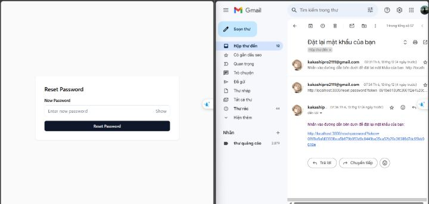
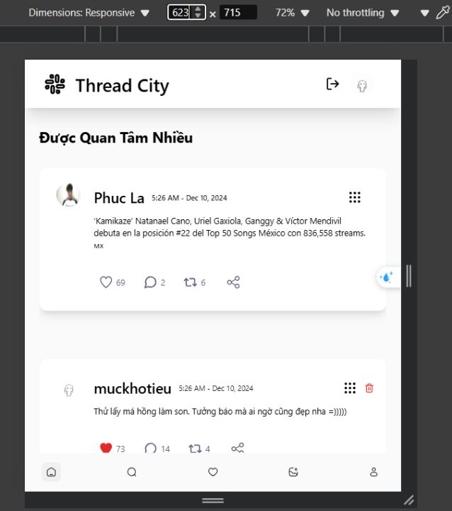
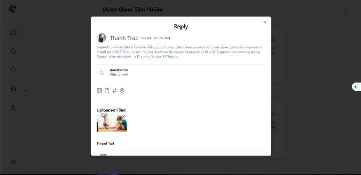
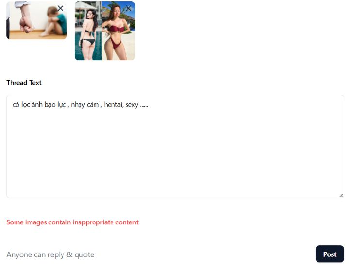
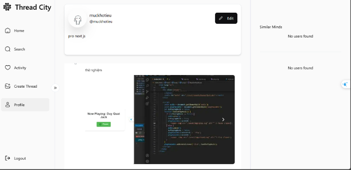
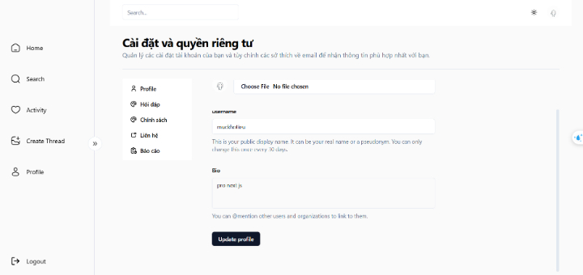
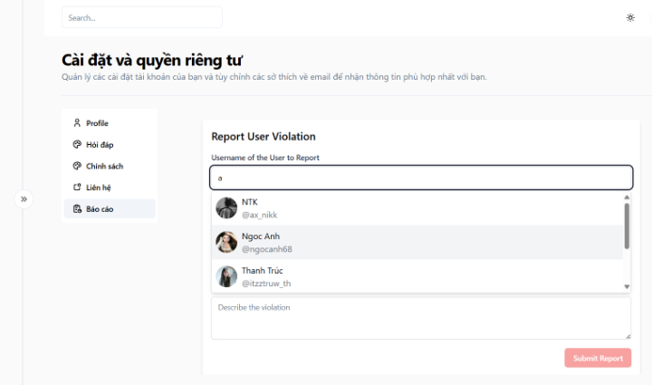
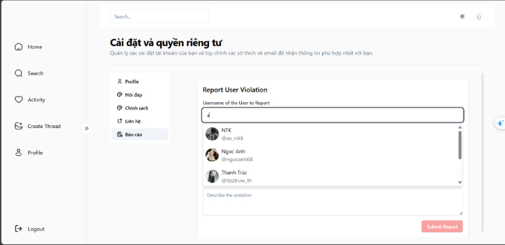
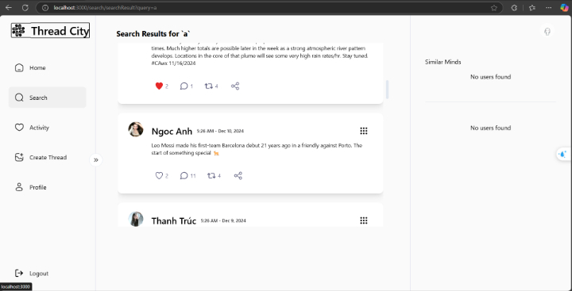
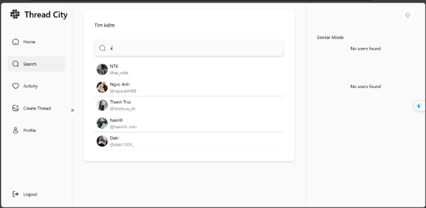

# Project: Thread Clone Web Application

## Tech Stack

**Frontend:** Next.js, TypeScript, Zustand, Shadcn

**Backend:** Express.js, MongoDB, Cloudinary, Socket.IO, NSFWJS

**Others:** Swagger, Node.js

## Features

- **Responsive Web Interface**: Developed a dynamic and responsive user interface using Next.js and TypeScript, ensuring compatibility across various devices and screen sizes.
- **User Authentication**: Implemented user authentication with JWT tokens, allowing users to securely register, login, and manage their sessions.
- **Real-time Messaging**: Integrated Socket.IO for real-time messaging functionality, enabling users to chat instantly within threads.
- **Image Upload**: Enabled users to upload images with automatic NSFW (Not Safe For Work) detection, leveraging NSFWJS for image classification.
- **Thread Creation & Management**: Allowed users to create threads, post comments, and manage their own posts.
- **Media Hosting with Cloudinary**: Integrated Cloudinary for efficient image hosting and retrieval, providing fast image loading and storage management.
- **API Documentation with Swagger**: Used Swagger to document the backend API, providing easy access to API endpoints and detailed documentation for developers.

## Demo Image

## Installation

We are in the process of completing the project 🔨 =-=
